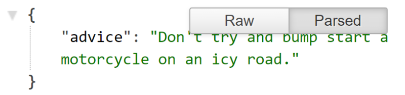
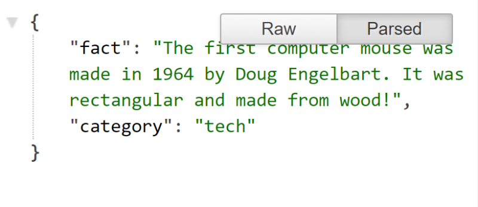

# Productivity props

## Team Members

1. Abdallah Abu Hussein

2. Mohammad Lebzo

3. Saif Saeed

4. Abdulkareem Shehadeh

5. Mohammad Abdo

6. Ammar Ramadan

## description of the project

- Our project includes many features that help the user in his daily life and contains many stuff ‘s like the weather forecast, news, movies show, a space for the joke and place for taking the notes.

## The overall problem domain and how the project solves those problems

- There is no site that has many features in one place like us , the user need to open and search for many site to get all these features, so we looked into the topic and then we create a site that contains many features and we were provided to the user in one site to give the user more convenience and ease of use.

## Semantic versioning, beginning with version 1.0.0 and incremented as changes are made

- Our Version is 1.0.1

## A list of any libraries, frameworks, or packages that your application requires in order to properly function

1. Libraries: Node.js, React.js, Axios, Mangos.

2. Framework: React.Js.

## Instructions that the user may need to follow in order to get your application up and running on their own computer

- It so easy he just wants to get this link run in his browser:

## Clearly defined API endpoints with sample responses

Description | example |
---------- |------------|
Inspiring Expressions: it give us the text and author name and everytime we use it give us a random tags **URL**`localhost:3001/getInspiringExpressions`|
Weather: it give us the weather forcast for the next 6 Days **URL**`localhost:3001/getWeather?city=Amman`| 
Moveis: it give us 4 random movies **URL**`localhost:3001/getMovie`| 
Advice: it give us a random advice **URL**`localhost:3001/getAdvice`| 
Fact: it give us fact and catigores **URL**`localhost:3001/getFunFacts`| 

***

## Clearly defined database schemas

- 

- 